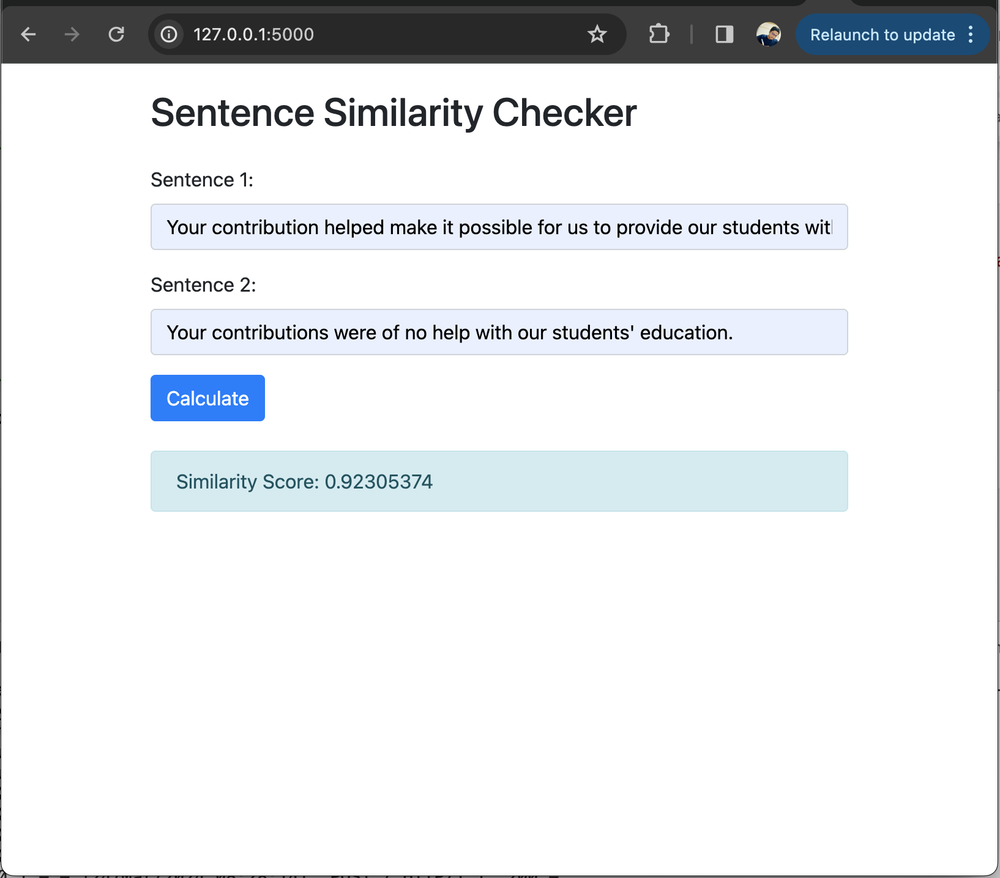

# A5-Sentence-Embedding-with-BERT

This repository houses a comprehensive analysis of sentence similarity models, including training, evaluation, comparison, and deployment through a web application. The project is divided into several key tasks, each aimed at exploring different facets of sentence similarity using BERT-based models.

## Overview

The project encompasses the following main tasks:

1. **Training BERT from Scratch with Sentence Transformer**: We detail the process of training a BERT model from scratch, tailored for sentence transformation tasks.
2. **Sentence Embedding with Sentence BERT**: Implementation and fine-tuning of a Sentence BERT (S-BERT) model for generating sentence embeddings.
3. **Evaluation and Analysis**: Comprehensive evaluation of the trained models against other pre-trained models, focusing on metrics like cosine similarity, Spearman correlation, and standard NLP performance metrics (Precision, Recall, F1 Score).
4. **Text Similarity Web Application Development**: Development of a Flask web application to demonstrate the practical application of the trained Sentence BERT model, allowing users to compute the similarity between two sentences.

## Getting Started

### Prerequisites

Ensure we have Python 3.x installed on system. Other key dependencies include PyTorch, Flask, `torchtext`, and `scikit-learn`. we can install these packages via pip:

```bash
pip install torch flask torchtext scikit-learn
```

### Installation

Clone the repository to local machine:

```bash
git clone https://github.com/shaficse/A5-Sentence-Embedding-with-BERT.git
cd A5-Sentence-Embedding-with-BERT
```

## Dataset Details

The project involved a thorough comparison of model performances using three key datasets: 

- **WikiMedical Sentence Similarity**: This dataset specializes in medical text, providing a unique challenge in understanding complex, domain-specific sentence structures and terminologies. It served as a crucial benchmark to assess the models' ability to handle specialized content.
  
- **SNLI (Stanford Natural Language Inference)**: A foundational dataset in natural language processing, SNLI comprises sentence pairs annotated with textual entailment information. It tests the models' general understanding of language and ability to infer relationships between sentences.

- **MNLI (Multi-Genre Natural Language Inference)**: Similar to SNLI but encompassing a broader range of genres and writing styles, MNLI challenges the models to adapt their inference capabilities across diverse contexts.


## Model Comparison


### Model Trainable Parameters Summary

Below is a tabular summary of the trainable parameters for each model evaluated in the Sentence Similarity Project:

| Model                | Trainable Parameters |
|----------------------|----------------------|
| Bert_scratch         | 37,073,759           |
| S_Bert               | 37,073,759           |
| Pretrained_S_BERT    | 33,360,000           |

- **Bert_scratch** and **S_Bert** share an identical count of trainable parameters, indicating similar complexity in their architectures.
- **Pretrained_S_BERT** demonstrates a streamlined architecture with fewer parameters, potentially enhancing efficiency while maintaining performance in sentence similarity tasks.


### BERT Scratch Model Performance on WikiMedical Sentence Similarity Dataset

#### Training, Validation & Test Loss

| Metric                 | Value  |
|------------------------|--------|
| Average Training Loss  | 9.2872 |
| Average Validation Loss| 8.3885 |
| Average Test Loss      | 0.7880 |

#### Precision, Recall & F1-Score

| Metric    | Value  |
|-----------|--------|
| Precision | 0.2178 |
| Recall    | 0.4667 |
| F1 Score  | 0.2970 |

#### Device
- CPU

#### Dataset Information

| Dataset     | Number of Rows |
|-------------|----------------|
| Train       | 85             |
| Test        | 15             |
| Validation  | 15             |

The tables above summarize the evaluation metrics for the BERT Scratch model, indicating potential issues with model convergence or architecture and areas for improvement.

#### Sentence BERT Model Performance on  `snli` and `mnli` Dataset by finetuning BERT Scratch Pre-trained Model

- Training , Validation & Test Loss

| Metric              | Value   |
|---------------------|---------|
| Average Training Loss | 1.1655  |
| Average Validation Loss | 1.0398  |
| Average Test Loss   | 1.1250   |

- Precision, Recall & F1-Score

| Metric    | Value   |
|-----------|---------|
| Precision | 0.1111  |
| Recall    | 0.3333  |
| F1 Score  | 0.1667  |


#### Device
CPU

#### Dataset Information

| Dataset     | Number of Rows |
|-------------|----------------|
| Train       | 85             |
| Test        | 15             |
| Validation  | 15             |


The tables above summarizes the evaluation metrics for the Sentence BERT model-  

- The Sentence BERT model achieves lower training, validation, and test losses compared to the BERT Scratch model on the WikiMedical Sentence Similarity dataset, indicating better performance and generalization capabilities.
- It achieved a precision of 0.1111, recall of 0.3333, and F1 score of 0.1667. 


## Comparison of Cosine Similarity Performance on `snli` and `mnli` Test Dataset

The table below presents a comparison of the average cosine similarity scores achieved by three different models on the `snli` and `mnli` Test datasets:

| Model            | Average Cosine Similarity |
|------------------|---------------------------|
| BERT Scratch     | 0.928735                  |
| Sentence BERT    | 0.925694                  |
| Pretrained BERT  | 0.593221                  |

- **BERT Scratch** and **Sentence BERT** models show highly competitive performance, with cosine similarity scores close to 0.93, indicating strong capabilities in capturing semantic similarities between sentences.
- **Pretrained BERT**, on the other hand, demonstrates a significantly lower average cosine similarity score, which suggests that, without further fine-tuning specific to the sentence similarity task, pretrained models may not perform as effectively.


## Comparison of Spearman Correlation Performance on `snli` and `mnli` Test Dataset

This table presents the Spearman correlation coefficients for the models on the `snli` and `mnli` test dataset, reflecting their alignment with human judgments of sentence similarity:

| Model                     | Spearman Correlation |
|---------------------------|----------------------|
| BERT Scratch              | 0.083205             |
| Sentence BERT             | -0.239710            |
| Pretrained Sentence BERT  | -0.604227            |

- **BERT Scratch** achieves a slight positive Spearman correlation, suggesting some level of agreement with human judgments of similarity.
- **Sentence BERT** and **Pretrained Sentence BERT** exhibit negative Spearman correlations, indicating a divergence from human similarity judgments, with Pretrained Sentence BERT showing the most significant deviation.


## Performance Summary: Model Selection for Deployment
- **BERT Scratch Model**: High training/validation losses and low precision/F1 score indicate convergence issues and inaccuracies in similarity detection.
- **Sentence BERT Model**: Exhibits lower losses and better overall performance, suggesting stronger generalization capabilities.
- **Pretrained Models**: Show limitations in domain-specific semantic capture, as evidenced by lower cosine similarity scores and negative Spearman correlations.

#### Deployment Considerations
1. **Performance vs. Requirements**: Sentence BERT's balanced performance makes it a suitable candidate for scenarios prioritizing accuracy in medical texts.
2. **Dataset Specificity**: Models trained on domain-specific datasets are preferred for similar deployment contexts.
3. **Computational Efficiency**: Consider computational demands in relation to the deployment environment.
4. **Integration and Maintenance**: Sentence BERT offers customization benefits but may require more maintenance effort.

#### Recommendation
For deployments focusing on medical domain accuracy, **Sentence BERT** is recommended due to its better loss metrics and generalization. Continuous performance monitoring and iterative improvements post-deployment are advised to ensure sustained effectiveness.

## Web Application Development

A Flask-based web application was developed to demonstrate the practical application of the trained Sentence BERT model, allowing users to calculate similarity scores between input sentences.

## Project Structure

- `model/`: Contains the trained model files and vocabulary.
- `templates/`: HTML templates for the Flask application.
- `app.py`: The Flask application script.
- `model_class.py`: The custom BERT model class definition.

### Running the Application

To start the Flask web application:

```bash
python app.py
```
   
Navigate to `http://127.0.0.1:5000/` in  web browser to interact with the application.


## Contributing

Contributions to this project are welcome. 

## License

This project is licensed under the MIT License - see the LICENSE file for details.

## Acknowledgments

This project leverages datasets and foundational research critical to its success:

- SNLI and MNLI datasets from Hugging Face ([SNLI](https://huggingface.co/datasets/snli), [MNLI](https://huggingface.co/datasets/glue/viewer/mnli)) for training and evaluating model performance on natural language inference tasks.
- The WikiMedical Sentence Similarity dataset ([WikiMedical](https://huggingface.co/datasets/nuvocare/WikiMedical_sentence_similarity)) for domain-specific model tuning.
- Research on Sentence BERT ([paper](https://aclanthology.org/D19-1410/)) provided the theoretical foundation for model architecture and training strategies.
- **Spacy, Huggingface** for proving the libraries to accomplish this task.

- **Flask framework** for enabling the deployment of interactive web applications.

- **Resource Contributions**: Special appreciation to [Chaklam Silpasuwanchai](https://github.com/chaklam-silpasuwanchai) for his invaluable contributions. The codebase for this project drew inspiration and guidance from his [Python for Natural Language Processing](https://github.com/chaklam-silpasuwanchai/Python-for-Natural-Language-Processing) repository, serving as a vital resource.

Special thanks to the authors and contributors of these resources for their valuable contributions to the NLP community.


